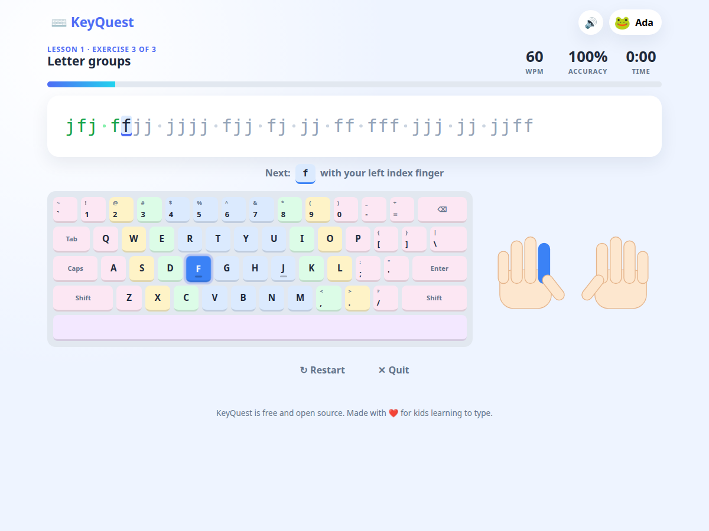

# KeyQuest ⌨️

A free, open-source typing tutor for kids, in the spirit of the classic Mavis Beacon Teaches Typing.
It runs entirely in your browser, works offline, needs no installation and never sends data anywhere.



## Features

- **24 lessons in 5 units**, starting with posture and hand placement, then keys outward from the home row, capitals, numbers and punctuation, ending with short stories. Each unit ends with a test.
- **Real drills, not letter soup**: every lesson has four to six exercises built from new-key patterns, alternating-hand rhythm groups, common bigrams and trigrams, words, phrases and sentences, all using only the keys taught so far. Exercises are generated fresh every time.
- **Mastery-based progress**: a lesson needs two stars to unlock the next, and unit tests need 90% accuracy. Grown-ups can switch on "unlock all" in Settings.
- **Skill levels** (little kid, kid, big kid) scale speed targets, exercise length and game speed so a six-year-old and an eleven-year-old both get a fair challenge.
- **Tricky-keys practice**: the app watches which keys a child misses most and offers a short targeted workout from the home screen.
- **On-screen keyboard and hands** with colour-coded fingers that light up to show which finger presses the next key.
- **Live feedback**: words per minute, accuracy, a mistake buzz, and a star rating (1 to 3) for every lesson.
- **Three games**:
  - *Letter Rain*: words fall from the sky and you type them before they hit the ground.
  - *Rocket Race*: type a passage to beat Robo's rocket, which flies at 10, 20 or 35 WPM.
  - *Bubble Pop*: single letters (and capitals, numbers and punctuation on the hardest setting) rise in bubbles; hit the key before they escape.
- **One-minute speed test** on kid-friendly paragraphs.
- **Progress tracking** per child: lesson stars, a per-key accuracy heatmap and recent activity.
- **Multiple typists** with their own avatar, settings and progress.
- **Sound effects** synthesised in the browser, so no audio files.
- **Backup and restore** progress as a JSON file.

## Running it

There is nothing to build or install.

**Option 1: just open it.** Double-click `index.html`. That's it.

**Option 2: serve the folder** (needed if your browser blocks local files, and for installing it as an app):

```bash
cd keyquest
python3 -m http.server 8080
# or: npx serve .
```

Then open <http://localhost:8080>.

Progress is saved in the browser's local storage on that computer. Use *Settings → Export progress* to move it somewhere else.

## Project layout

```
index.html          page structure, all screens
css/style.css       all styling
js/data/words.js    word, sentence and paragraph banks
js/data/lessons.js  curriculum, finger map and exercise generator
js/engine.js        typing session: position, errors, WPM, per-key stats
js/keyboard.js      on-screen keyboard, hands SVG, heatmap
js/audio.js         synthesised sound effects (Web Audio)
js/storage.js       profiles and progress in localStorage
js/game.js          Letter Rain game
js/race.js          Rocket Race game
js/bubbles.js       Bubble Pop game
js/app.js           screens, navigation and glue
```

Plain ES2020 JavaScript loaded as classic scripts, so it works from `file://` without a bundler.
Everything hangs off a single `KQ` namespace.

## Customising

- **Add words or sentences**: edit `js/data/words.js`. Sentences are automatically lowercased and stripped of punctuation for learners who haven't reached those lessons yet.
- **Change the curriculum**: edit `RAW_LESSONS` in `js/data/lessons.js`. Each lesson lists the new keys it introduces, its unit, a kind (`intro`, `keys`, `review`, `shift`, `numbers`, `punct`, `story`) and a tip. Review lessons automatically get a unit test.
- **Adjust difficulty**: per-unit speed targets and exercise lengths are `UNIT_WPM` and `UNIT_LEN` in the same file, skill-level multipliers are in `KQ.LEVELS`, star thresholds live in `KQ.starsFor` in `js/engine.js`, and the stars needed to unlock the next lesson is `KQ.MASTERY_STARS` in `js/storage.js`.
- **Other keyboard layouts**: the finger map and physical layout are in `KQ.FINGERS` and `KQ.LAYOUT`. Adding AZERTY or Dvorak means adding alternative tables and a setting to pick one. Contributions welcome.

## Development

The app needs no build. For the end-to-end tests:

```bash
npm install
npx playwright install chromium   # once
npm test
```

The tests serve the repo on a random port, drive the whole app in a headless browser, and check the curriculum generator, lesson flow, mastery rules, weak-key practice, games and persistence. Set `CHROME_PATH` to use an installed Chrome instead of the bundled Chromium, or `HEADED=1` to watch.

Pushes to `main` run the tests and deploy the site to GitHub Pages.

## Contributing

Bug reports, new word lists, lessons, games and translations are all welcome. Keep it dependency-free and kid-friendly.

## License

MIT. See [LICENSE](LICENSE).

*Mavis Beacon is a trademark of its respective owner. KeyQuest is an independent project and is not affiliated with it.*
